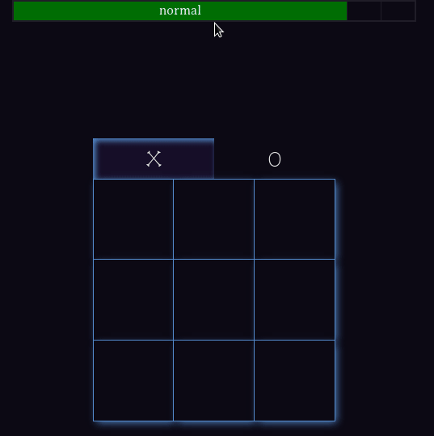

# tic tac toe
This repository is the solution to one of the assignments given in [The Odin Project]() - a web development course. The goal was to create tic tac toe game, while using modules and factory functions. The game has three difficulty levels: 
* Normal - computer makes random moves.
* Hard - computer makes half random half AI moves.
* Impossible - All moves are AI, making computer impossible to beat.  
  

